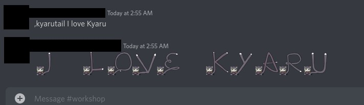

# kyarutail

<CogHero cog="kyarutail" :desc="$frontmatter.description" />

> ⚠ **Notes**
>  
> Due to a recent Discord update, the emotes may not show. You may need to manually add Kyarutail emotes to your Discord server and invite your Discord bot into that server, before the bot can properly send the Kyarutail emotes.

This Kyarutail cog is a Discord bot for converting text you type into emote letters from Kyaru's tail.

Kyaru, also known as Karyl in the English version, is a character from Priconne (Princess Connect! Re:Dive).

This cog replaces the letters you send with <:emote:1234567890>, matching a letter to a provided emote ID. Default emote IDs are from Kyarutail server, though all letters can be changed if you have other letter emotes you'd rather use.

This cog does not save or store any images. This cog does not collect user data.

Kyarutail cog is not endorsed by Kyarutail Discord server, the creator of Kyarutail, or Princess Connect! Re:Dive.
