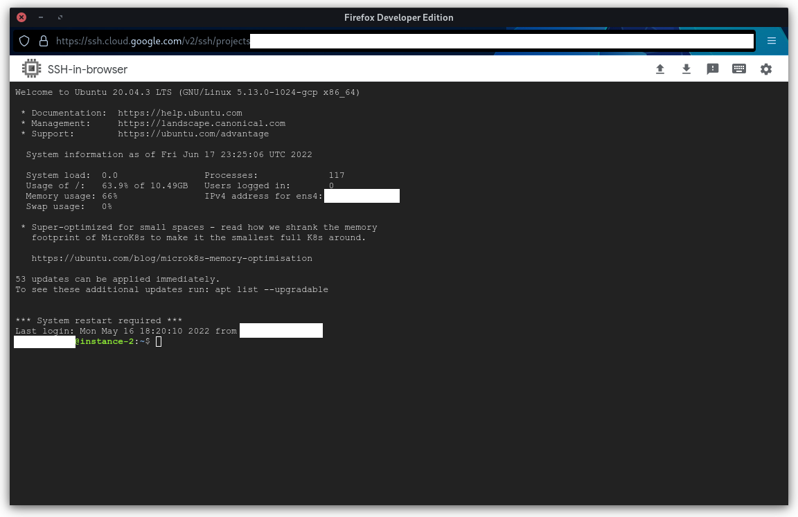

# Getting Started

Thyme Coffee bots are self-hosted Discord bots that can take your Discord server to the next level.

### Step 1: Install prerequisites

Click one below to begin:

<details class="py-2">
<summary class="px-4 cursor-pointer">
  <span class="font-bold px-4 pb-1">Start in Windows (Use your own PC)</span>
  <p>By using Windows, your bot will only run when your PC is on. If you turn your PC off, your bot will also be turned off.</p>
</summary>
<blockquote markdown=1>

To get started, set up WSL2 with the walkthrough below:

<br>

<VueFrame to="https://www.youtube.com/embed/5EgV91-f1co?start=0&end=249&version=3&autoplay=0&modestBranding=1&rel=0&showinfo=0" />

<br>

When you are done, move to Step 2 below.

</blockquote>
</details>

<details class="py-2">
<summary class="px-4 cursor-pointer">
  <span class="font-bold px-4 pb-1">Start in a Cloud Server (Amazon AWS, Google GCP, Linux, etc.)</span>
  <p>A "cloud server" is a fancy word for "a PC that's on 24/7, run by a company". These are usually paid (computers are expensive!), and run with Linux.</p>
</summary>
<blockquote markdown=1>

This guide will focus on a cloud server with a generous free plan: Google Cloud Platform (GCP).

<br>

Here is how to set up Google Cloud Platform:

<br>

<VueFrame to="https://www.youtube.com/embed/-6u1NHKgqao?start=0&end=345&version=3&autoplay=0&modestBranding=1&rel=0&showinfo=0" />

<br>

```
3:21
Use e2-micro instead. The f1-micro instance no longer exists.
https://cloud.google.com/free/docs/gcp-free-tier/#compute

4:09
Choose Ubuntu 2204

4:21
Change the disk to "Standard persistent disk"
Change the storage to 30 GB
These will stay within the Free tier limits
```

</blockquote>
</details>

<br>

### Step 2: Download Red DiscordBot



After the setup above, you should see a console with a similar screen above.

Click this link to see setup instructions:

<VueButton to="https://docs.discord.red/en/stable/install_guides/ubuntu-2204.html">
  Installing Red DiscordBot
</VueButton>

For each line of code in the link above, copy-paste into your console and press enter.

Wait for each line to finish running before continuing.

<br>

### Step 3: Add your bot to your Discord server

<VueButton to="https://docs.discord.red/en/stable/getting_started.html">
  Getting Started
</VueButton>

<br>

### Step 4: Add coffee-cogs

**Red DiscordBot** supports adding plugins ("cogs") to make the bot do more stuff.

**coffee-cogs** is a collection ("repository") of plugins ("cogs") you can add to your **Red DiscordBot**.

When you're ready, browse the list of Thyme Coffee bots and find one you like!

You will see an **Install** box. Just copy-paste the commands and enter them into a chat with your bot:

> Replace [p] with your prefix  
> Replace %%%% with the name of the cog
```
[p]repo add coffee-cogs https://github.com/coffeebank/coffee-cogs
[p]cog install coffee-cogs %%%%%
```

You're done!
