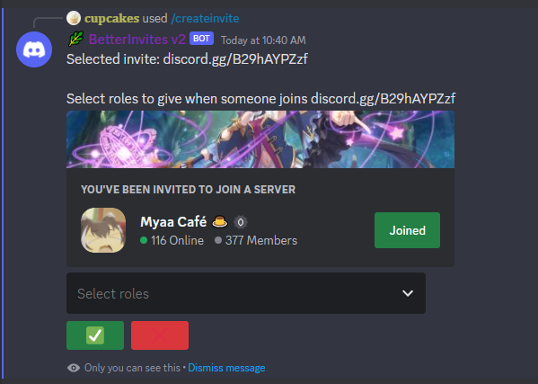

📣 New v2 
Supports Slash Commands 

<a href="/status/">⚠️ Active Issues - Read More</a> 

# BetterInvites

The best bot for all your invite roles. 100% free, forever.

BetterInvites makes Discord invites more powerful by giving members who join with an invite certain roles

## [Invite me](https://thymedev.github.io/invite/betterinvites)
## [Support server](https://thymedev.github.io/discord.html)

 

## Commands
**`/createinvite [invite]`**: 
>Starts the process to create a new invite role.  
>Use autocomplete to select an existing invite or type an invite code. discord.gg/abcdefg has code abcdefg  
>Then select your role(s), and click ✅, everything is set up!

{.bg-discord-bg-primary}

**`/display`**:
>Lists the set up invite roles.

**`/refresh`**:
>Refreshes invite cache. Run this if you believe the bot missed a member joining.

**`/help`**:
>Displays helpful information (basically this page)

 

### Remove a role invite
Use the `/createinvite [invite]` command again and don't select any roles. The bot will not assign any roles to people who use that invite.
Confirm it has been removed with `/display`.

### Assign multiple roles for each invite
If you would like an invite to give multiple roles when someone joins, select multiple roles when prompted.

 

## Something is not working!
### It says "I can't interact with the following roles:..."
Verify that role hierarchies allow BetterInvites to give those roles. It cannot give roles higher on the hierarchy than itself. [more info](https://support.discord.com/hc/en-us/articles/214836687-Role-Management-101).

### Roles are not being assigned!
It's possible permissions may not be set up correctly. Try kicking and reinviting the bot with [this](https://thymedev.github.io/invite/betterinvites).

## More Info

### Suggestions and bug reports
Please direct all suggestions and bug reports to [our support server](https://thymedev.github.io/discord.html)
