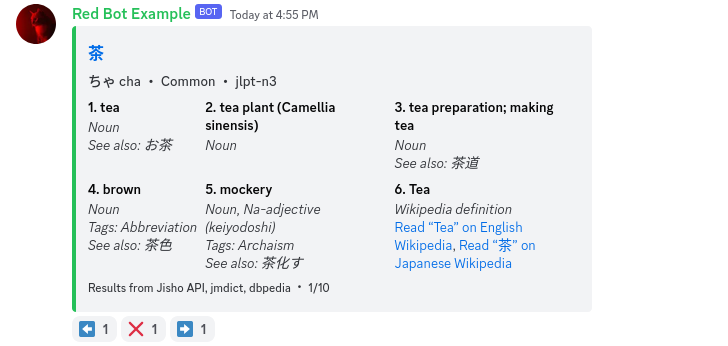

# 🍵 茶 Cha for Japanese

A delightfully refreshing Discord bot for searching and translating Japanese.

## [Invite me](https://thymedev.github.io/invite/chaja)
## [Support server](https://thymedev.github.io/discord.html)

 

Japanese dictionary bot. Searches Jisho using Jisho API. Includes alternate links to Wiktionary, DeepL, and Google Translate.

## About

**CHA-JA is the Japanese Discord bot that delivers language and dictionary information to students, travelers, and anime enthusiasts alike.**

The Japanese language is one of the most intricate and beautiful languages in the world. However, its three scripts - Kanji, Hiragana, and Katakana - make it challenging for beginners. Often, learners face difficulties with romanization (Romaji), understanding word definitions, and accessing comprehensive information about vocabulary.

**CHA-JA** is a unified turnkey solution for searching dictionary sources, displaying Romaji pronunciations, word definitions/origins, and links to relevant external sources.

**CHA-JA** uses data from public sources including [Jisho](https://jisho.org/about).

## Getting Started

The public bot invite link is still in development. Please [self-host this bot](/start) or [join the Discord](https://coffeebank.github.io/discord) to stay tuned!

This bot does not require any APIs.

## Features

- Search dictionary entries in Japanese (Hiragana, Katakana, Kanji)
- Search dictionary entries in Japanese Romanization (Romaji)
- Search dictionary entries in English
- Word origins in Kanji
- Parts of speech

## Commands

The bot uses slash commands.

- `/jadict` : Searches Japanese dictionary
- `/jasearch` : Searches Japanese translation services

This bot also supports a ping as a prefix: `@Cha for Japanese `  
*For example: `@Cha for Japanese jadict 茶`*
