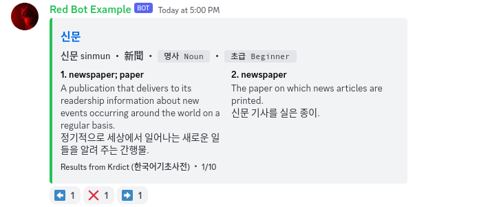

# 🍵 차 Cha for Korean

A delightfully refreshing Discord bot for searching and translating Korean.

<h2><a href="https://thymedev.github.io/invite/chako" style="text-decoration-line: line-through;color:#cccccc;">Invite me</a></h2>

Note: This bot has currently reached the maximum cap of 100 servers. We are working to approve this bot for Discord Verification. Thank you for your patience and support!  To self-host this bot: <a href="https://github.com/coffeebank/kodict-dpy" target="_blank">kodict-dpy ▸</a>

## [Support server](https://thymedev.github.io/discord.html)

 

Korean dictionary bot. Searches National Institute of Korean Language's Korean-English Learners' Dictionary (한국어기초사전), translates Korean using DeepL, and resources including Wiktionary, Google Translate, and romanization.

## About

**CHA-KO is the Korean Discord bot that delivers language and dictionary information to students, travelers, and kpop/kdrama enthusiasts alike.**

Korean, with its unique alphabet, is a fascinating language that draws learners from around the world. However, the journey to fluency can be challenging. Learners often struggle with understanding the language's structure, pronunciation, Hanja, and the cultural nuances inherent to Korean.

**CHA-KO** is a unified turnkey solution for searching dictionary sources, displaying Hangul Romanization, word definitions/origins, and links to relevant external sources.

**CHA-KO** uses data from public sources including the National Institute of Korean Language's [Korean-English Basic Learners' Dictionary](https://krdict.korean.go.kr/mainAction).

## Features

- Search dictionary entries in Korean (Hangul, Hanja)
- Search dictionary entries in English
- Pronunciation in Hangul and Romanization
- Word origins in Hanja
- Parts of speech

## Commands

This bot uses slash commands.

- `/kodict` : Searches Korean dictionary
- `/kosearch` : Searches Korean translation services

This bot also supports a ping as a prefix: `@Cha for Korean `  
*For example: `@Cha for Korean kodict 신문`*
